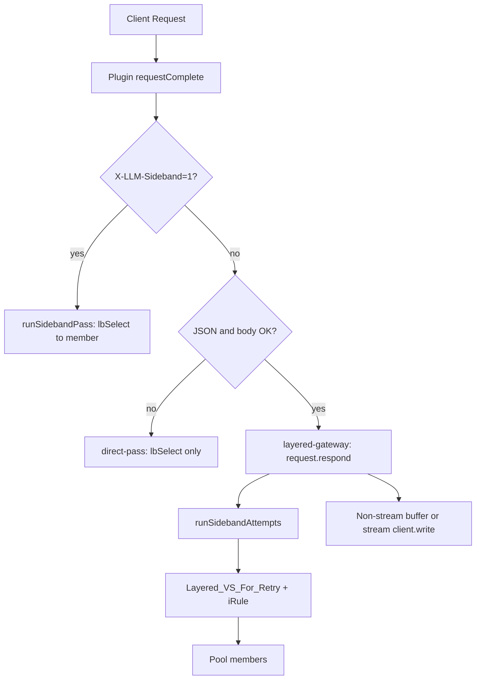

# BIG-IP iRuleLX LLM API 智能路由插件

> **源码位置**：插件实现在同级目录 [`../llm_router/extensions/llm_router_ext/`](../llm_router/extensions/llm_router_ext/)（`index.js`、`usage_extractor.js`、`config/usage_profiles.json`）。Subagent 网关见 [`../llm_router/extensions/subagent_router_ext/`](../llm_router/extensions/subagent_router_ext/)。F5 部署脚本见 [`deploy.sh`](deploy.sh)（本演示应用）与 [`../llm_router/deploy.sh`](../llm_router/deploy.sh)（完整环境）。

## 目录

1. [背景与设计目标](#1-背景与设计目标)
2. [整体架构](#2-整体架构)
3. [关键组件说明](#3-关键组件说明)
4. [代码执行流程逐步详解](#4-代码执行流程逐步详解)
5. [核心函数详解](#5-核心函数详解)
6. [关键设计决策说明](#6-关键设计决策说明)
7. [配置常量速查](#7-配置常量速查)
8. [日志说明与调试](#8-日志说明与调试)
9. [运维操作手册](#9-运维操作手册)
10. [已知限制](#10-已知限制)
11. [数据发送：Node.js 还是 TMM？](#11-数据发送nodejs-还是-tmm)
12. [Data Group Value 格式详解与高级路由功能](#12-data-group-value-格式详解与高级路由功能)
13. [Retry / Fallback 与 Layered_VS_For_Retry](#13-retry--fallback-与-layered_vs_for_retry)
14. [Retry / Fallback 全链路工作原理](#14-retry--fallback-全链路工作原理请求路径视角)
15. [Usage profile 联调](#15-usage-profile-联调test_inference_serverpy)
16. [Subagent 网关（agent identity 路由）](#16-subagent-网关agent-identity-路由)

---

## 1. 背景与设计目标

### 问题场景

企业内部部署了多个 LLM 后端服务（OpenAI GPT-4o、Claude、Gemini、DeepSeek 等），客户端通过统一的 F5 BIG-IP 入口发送 API 请求。不同的模型托管在不同的后端服务器集群，需要根据请求中指定的 `model` 字段，将请求路由到对应的后端 Pool。

```
客户端请求：{"model": "gpt-4o", "messages": [...]}   →  pool_openai_gpt4o
客户端请求：{"model": "deepseek-chat", "messages": [...]}  →  pool_deepseek
客户端请求：{"model": "未知模型", "messages": [...]}   →  pool_llm_default
```

### 设计目标

| 目标 | 实现方式 |
|------|---------|
| 准确解析 JSON body 中的 `model` 字段 | 正则优先 + JSON.parse 兜底的双重解析策略 |
| 根据 model 路由到不同 Pool | `buildRoutingDecision()` 查 Data Group → `X-LLM-Target-Pool` 下发 Layered VS |
| 新增/删除 model 路由零停机 | Data Group 热更新，plugin 自动同步 |
| body 完整转发到后端 | `readable` 缓冲；Layered 路径经 `ILXHttpRequest`；内部 hop 用 `server.write()` |
| Retry / Fallback / TBLB | 客户端 JSON 统一走 `layered-gateway` → `/Common/Layered_VS_For_Retry` + iRule |
| 流式与非流式统一编排 | `request.respond()` + 侧带 SSE 增量写回（HTTP chunked 分帧） |
| 转发前替换 model name | JSON.parse → 修改 `.model` → JSON.stringify |
| 按 context size 智能分流 | `calcContextSize(messages)` 超阈值切换大 context Pool 并替换 model |
| Observability | 终态 `llm_request_completed` 事件 POST 至 Adapter（`:8090/events`） |
| Usage 多引擎兼容 | `usage_profiles.json` + `usage_extractor.js` 解析各厂商 token 字段 |

---

## 2. 整体架构

### 请求处理路径（当前默认：layered-gateway）

```
  Client
    │  POST /v1/chat/completions  (stream:true/false)
    ▼
┌──────────────────────────────────────────────────────────────────────────┐
│  入口 VS  vs_llm_inferecen_gateway  (HTTP Profile + ILX Profile)         │
│                                                                          │
│  iRuleLX Plugin (llm_router_ext)                                         │
│    ① requestStart / readable ── 缓冲 body                                │
│    ② requestComplete                                                     │
│         ├─ X-LLM-Sideband:1 ? → runSidebandPass（Layered 内部 hop）      │
│         ├─ buildRoutingDecision()                                        │
│         │     extractModel → resolveRouting → calcContextSize → rewrite  │
│         └─ layered-gateway（JSON 且未超限）                              │
│               request.respond()                                          │
│               runSidebandAttempts() ── ILXHttpRequest ──────────────┐    │
│                                                                      │    │
│  非 JSON 或 body 超限 → direct-pass（lbSelect + server.write）       │    │
└──────────────────────────────────────────────────────────────────────│────┘
                                                                       ▼
┌──────────────────────────────────────────────────────────────────────────┐
│  Layered_VS_For_Retry  (HTTP Profile + iRule，**不挂 ILX Profile**)      │
│    读 X-LLM-Target-Pool / X-LLM-Fallback-Pool / X-LLM-TBLB-Enabled       │
│    TBLB Scheduler 选 member · LB_FAILED reselect · 跨池 fallback         │
│    回写 X-LLM-Selected-Member / X-LLM-Retry-Terminal                     │
└──────────────────────────────────────────────────────────────────────────┘
         │  sideband 内部 hop（X-LLM-Sideband:1 回到入口插件）
         ▼
    Pool members → 推理后端
         │
         ▼
  Plugin 组装响应回 Client（非流式缓冲 / 流式 chunked SSE）
  终态 emitStructuredEvent → POST http://127.0.0.1:8090/events
```

### 涉及的 BIG-IP 对象

```
ltm data-group internal llm_model_pool_map      ← model→pool 映射（field1/2/3）
ltm data-group internal subagent_agent_pool_map ← Subagent 身份→pool（独立 VS）
ilx plugin          llm_router_plugin           ← 入口 VS 插件
ilx plugin          subagent_router_plugin      ← Subagent VS 插件
ltm profile ilx     llm_router_ilx_profile
ltm virtual         vs_llm_inferecen_gateway    ← 入口 VS（172.16.30.122:8000）
ltm virtual         vs_subagent_llm_gateway     ← Subagent VS（172.16.30.121:8000）
ltm virtual         Layered_VS_For_Retry        ← 侧带 Retry/TBLB iRule VS
                      ├── profile http          ← 必须
                      └── profile ilx           ← 仅入口 VS；Layered VS 不要挂 ILX
```

---

## 3. 关键组件说明

### 3.1 iRuleLX Plugin（[`../llm_router/extensions/llm_router_ext/index.js`](../llm_router/extensions/llm_router_ext/index.js)）

iRuleLX 是 F5 BIG-IP 的 Node.js 数据平面编程接口。与传统 iRule（TCL 脚本）相比，iRuleLX 可以运行完整的 Node.js 代码，适合处理复杂的 JSON 解析逻辑。

Plugin 运行在 BIG-IP 的 Linux 层，通过 Unix socket 与数据平面（TMM）通信。每当有新的客户端连接建立时，TMM 会通知 Plugin，Plugin 可以检查、修改、放行或拒绝这个连接。

### 3.2 Data Group（`llm_model_pool_map`）

Data Group 是 BIG-IP 内置的键值存储，**键**为客户端请求中的 model 名称，**值**为路由配置字符串。

#### Value 字段格式

```
field1[,field2[,field3]]
```

| 字段 | 必须 | 含义 |
|------|------|------|
| `field1` | 是 | 目标 Pool 的完整路径，如 `/Common/pool_deepseek-chat` |
| `field2` | 否 | 转发前将请求 body 中的 `model` 字段替换为该值；留空表示不替换（逗号仍须保留占位） |
| `field3` | 否 | Context size 路由规则，格式为 `Size\|<N>k\|<largePool>\|<largeModel>`（见下） |

**field3 格式说明：**

```
Size|<N>k|<largePool>|<largeModel>
  │    │       │           └─ 超出阈值时注入请求的 model name
  │    │       └─────────── 超出阈值时路由到的 Pool
  │    │                    （不含 / 开头则自动补 /Common/ 前缀）
  │    └─────────────────── 阈值，单位 k（1k = 1024 字节）
  └──────────────────────── 固定标识符 "Size"
```

context size 的计算对象为请求 body 中 `messages` 数组的 JSON 序列化字节长度，涵盖所有嵌套字段（`role`、`content`、`tool_calls`、`assistant` 等）。

#### 四种 Value 配置示例

```
# 类型 1：仅路由，不修改 model name，不判断 context size
/Common/pool_gpt-3.5-turbo

# 类型 2：路由 + 替换 model name
/Common/pool_gpt-4o,gpt-4o

# 类型 3：路由 + context size 分流（不替换小 context 的 model name）
/Common/pool_deepseek-chat,,Size|100k|pool_deepseek_v4|deepseek-v4-flash

# 类型 4：路由 + 替换 model name + context size 分流
/Common/pool_deepseek-chat,deepseek-chat,Size|100k|pool_deepseek_v4|deepseek-v4-flash
```

类型 3 的行为说明：
- messages 字节数 ≤ 100×1024 → 路由到 `pool_deepseek-chat`，**不替换** model name
- messages 字节数 > 100×1024 → 路由到 `/Common/pool_deepseek_v4`，model name 替换为 `deepseek-v4-flash`

特殊键：

| 键名 | 用途 |
|------|------|
| `__default__` | 兜底条目，当请求的 model 在 DG 中无精确匹配时使用 |

**最重要的特性**：Data Group 修改后，Plugin 会**自动实时同步**，无需重启任何服务。这是实现零停机新增 model 路由的基础。

### 3.3 Virtual Server 配置要求

Virtual Server 必须同时挂载两个 Profile：

- **HTTP Profile**：让 BIG-IP 以 HTTP 协议解析流量，这样 Plugin 才能收到 `requestStart`、`requestComplete` 等 HTTP 层事件。没有这个 Profile，Plugin 只能看到原始 TCP 字节流。
- **ILX Profile**：将 Plugin 挂载到 Virtual Server，告诉 TMM 把流量交给 Node.js 处理。

---

## 4. 代码执行流程逐步详解

下面按照代码的实际执行顺序逐步讲解，每个步骤标注了对应的代码行号。

### 整体时序图（layered-gateway 主路径）

```
时间轴 ──────────────────────────────────────────────────────────────────►

Plugin 进程
  │
  ├─[initialized] 加载 llm_model_pool_map + usage_profiles.json
  │
  └─ 每个 HTTP 请求 ───────────────────────────────────────────────────►

  ├─[requestStart]   POST JSON? → isJsonRequest；预设 closeClient=false
  ├─[readable ×N]    bodyChunks[] 累积；超 MAX_BODY_BYTES → overLimit
  ├─[requestComplete]
  │     ├─ X-LLM-Sideband:1 → runSidebandPass（lbSelect + server.write）
  │     └─ buildRoutingDecision()
  │           extractModel → resolveRouting → calcContextSize? → rewrite?
  │           useLayered ?
  │             ├─ yes → runLayeredGateway
  │             │         request.respond()
  │             │         runSidebandAttempts (primary×N + fallback)
  │             │           ILXHttpRequest → Layered_VS_For_Retry
  │             │           非流式：缓冲 → sendRespondToClient
  │             │           流式：chunked SSE → writeHttpChunkBody
  │             │         metrics.finalize → POST /events
  │             └─ no  → runSidebandPass（direct-pass）
  │
  └─ Layered 内部 hop 再次进入插件（Sideband 标记）→ 仅 lbSelect 到 member
```

> **与旧版差异**：客户端 JSON 请求不再走「lbSelect + allow + 响应 TMM 透传」单跳路径；响应由插件经 `request.respond()` 侧带编排后写回客户端。仅 **direct-pass** 与 **sideband-pass** 仍使用 `runSidebandPass`。

---

### 步骤 0：Plugin 启动与初始化（`initialized` 事件）

**对应代码：第 123–139 行**

```javascript
// 第 123 行
plugin.on('initialized', function () {
    try {
        dg = plugin.getDataGroup(DG_NAME);
        // DG_NAME = '/Common/llm_model_pool_map'
        logger('info', 'Plugin initialized. Data Group loaded: ' + DG_NAME +
               ' (' + dg.getSize() + ' records)');
    } catch (e) {
        logger('err', 'Failed to load Data Group "' + DG_NAME + '": ' + e.message);
        dg = null;
    }
});

// 第 134 行
plugin.on('uninitialized', function () {
    logger('warn', 'Plugin uninitialized — no longer associated with a Virtual Server.');
    dg = null;
});
```

**发生了什么：**

Plugin 进程启动后，会连接到 BIG-IP 的 TMM（流量管理微核）。连接成功后触发 `initialized` 事件。这是整个 Plugin 生命周期中**只执行一次**的初始化代码。

在这里调用 `plugin.getDataGroup()` 获取 Data Group 的句柄（`dg`），保存为进程级全局变量。之后每个请求的 `resolveRouting()` 调用都直接操作这个内存对象，无需任何 I/O。

若 Data Group 加载失败（`dg = null`），每次请求会退化到 `HARD_FALLBACK_POOL` 硬编码兜底，不会崩溃。

当 Plugin 与 Virtual Server 解除关联时，`uninitialized` 事件将 `dg` 重置为 `null`，防止后续请求使用失效的 DG 引用。

> **为什么必须在 `initialized` 事件里调用？**
> F5 API 规定：在 `initialized` 之前调用 `getDataGroup()` 会抛出异常。Plugin 与 TMM 的通信通道在 `initialized` 时才建立完成，Data Group 数据此前不可访问。

---

### 步骤 1：新 TCP 连接建立（`connect` 事件）

**对应代码：第 143–333 行**

```javascript
// 第 143 行
plugin.on('connect', function (flow) {

    // 第 153–156 行：请求级状态变量，每次 requestStart 重置
    let isJsonRequest = false;   // 是否为 POST JSON 请求
    let bodyChunks    = [];      // body 分块缓冲区
    let bodySize      = 0;       // 已读字节数（用于 MAX_BODY_BYTES 守卫）
    let overLimit     = false;   // body 超限标志

    // 后续注册 requestStart / readable / requestComplete / error 事件...
});
```

**发生了什么：**

每当一个新的客户端 TCP 连接建立时，TMM 通知 Plugin，Plugin 收到一个 `flow`（流）对象，代表一条完整的端到端连接：

```
flow.client  ← 客户端侧代理 socket（读取请求数据）
flow.server  ← 服务器侧代理 socket（向后端 Pool 写数据）
```

4 个状态变量定义在 `connect` 闭包中，生命周期横跨该 TCP 连接上的所有 HTTP 请求：

| 变量 | 类型 | 说明 |
|------|------|------|
| `isJsonRequest` | boolean | `requestStart` 中判断为 POST JSON 时置 `true`，否则后续步骤跳过 model 解析 |
| `bodyChunks` | `Buffer[]` | `readable` 事件中逐块累积的 body 数据，`requestComplete` 后清空 |
| `bodySize` | number | 累计字节数，超过 `MAX_BODY_BYTES`（1 MB）时触发 `overLimit` |
| `overLimit` | boolean | `true` 时跳过 model 解析与 context size 计算，直接路由到默认 Pool；body 仍完整转发 |

> **为什么要在 `connect` 里初始化而不是 `requestStart` 里？**
> 变量定义在 `connect` 闭包中，使 `requestStart`、`readable`、`requestComplete` 三个事件回调共享同一作用域，天然避免了跨事件传参。`requestStart` 中的重置逻辑则保证 HTTP Keep-Alive 场景下多个请求之间状态互不污染。

---

### 步骤 2：HTTP 请求头到达（`requestStart` 事件）

**对应代码：第 146–165 行**

```javascript
flow.client.on('requestStart', function (request) {
    // 重置状态（处理 keep-alive 多请求）
    isJsonRequest = false;
    bodyChunks    = [];
    bodySize      = 0;
    overLimit     = false;

    const method      = request.params.method.toUpperCase();
    const contentType = request.params.headers['content-type'].toLowerCase();

    if (method === 'POST' && contentType.includes('application/json')) {
        isJsonRequest = true;
    }
});
```

**发生了什么：**

当 BIG-IP 收到完整的 HTTP 请求头（第一行 + 所有 Header，但还没有 body）时，触发 `requestStart`。此时可以读取请求方法、URL、所有请求头。

代码在这里做一个快速判断：**这个请求值得解析 model 字段吗？**

- 必须是 `POST` 方法（LLM API 都是 POST）
- Content-Type 必须包含 `application/json` 或 `text/plain`

如果不满足条件（比如 GET 请求、健康检查等），设置 `isJsonRequest = false`，后续直接放行，不消耗解析资源。

> **注意**：此时 body 还没有到达，只有请求头可用。body 会在后续的 `readable` 事件中陆续到来。

---

### 步骤 3：请求 Body 分块读取（`readable` 事件）

**对应代码：第 184–199 行**

```javascript
// 第 184 行
flow.client.on('readable', function () {
    let chunk;
    while ((chunk = flow.client.read()) !== null) {
        bodyChunks.push(chunk);          // 所有请求的 body 块都缓冲，确保完整转发

        if (!overLimit) {
            bodySize += chunk.length;
            if (bodySize > MAX_BODY_BYTES) {
                overLimit = true;        // 超限：后续跳过 model 解析，body 仍转发
                logger('warn', 'Body exceeds MAX_BODY_BYTES ...');
            }
        }
        // overLimit 为 true 后继续 push chunk，保证后端收到完整 body
    }
});
```

**发生了什么：**

HTTP body 数据可能跨多个 TCP 包分批到达。每当有新数据可读时触发 `readable` 事件，代码用 `while` 循环一次性耗尽当前可读数据：

```
readable 触发（可能触发多次）
  └─► read() → chunk₁ → bodyChunks.push(chunk₁)
  └─► read() → chunk₂ → bodyChunks.push(chunk₂)
  └─► read() → null   → 本轮数据读完，退出循环
```

**关于 `overLimit` 的处理细节：**

- `overLimit = true` 后，`bodySize` 不再累加（避免整数溢出），但 `chunk` 仍被 push 进 `bodyChunks[]`
- 目的：即使 body 超过 1 MB，后端仍能收到完整请求；只是路由决策退化为默认 Pool，不尝试解析 model

> **为什么用 `readable` 而不用 `data` 事件？**
> 这是本插件最关键的技术细节，详见[第 6 章](#61-为什么用-readable-而不用-data-事件)的专题说明。

---

### 步骤 4：请求接收完毕（`requestComplete` 事件）

**对应代码：第 209–316 行**

`requestComplete` 在 **body 完整接收后**触发，F5 框架保证此时所有 `readable` 事件均已处理完毕。这是整个插件的**决策核心**，分 7 个子步骤严格按顺序执行。

```
4a → 4b → 4c（条件）→ 4d（条件）→ 4e → 4f → 4g
提取   获取路由   context判断   model替换   lbSelect  allow  server写入
model  决策对象   （可选）      （可选）
```

---

#### 子步骤 4a：提取 model name

**对应代码：第 218–219 行**

```javascript
const bodyStr   = Buffer.concat(bodyChunks).toString('utf8');
const modelName = extractModel(bodyStr);
```

将 `readable` 阶段累积的所有 Buffer 块拼接为完整字符串，调用 `extractModel()` 提取顶层 `"model"` 字段值。

若请求不是 JSON（`isJsonRequest = false`）或 body 超限（`overLimit = true`），则跳过此块，`targetPool` 直接使用兜底值，body 照常转发。

---

#### 子步骤 4b：获取完整路由决策对象

**对应代码：第 226–228 行**

```javascript
const routing     = resolveRouting(modelName);
let   pool        = routing.pool;          // 目标 Pool 路径
let   targetModel = routing.modelOverride; // 替换用 model name（'' = 不替换）
```

`resolveRouting()` 在 Data Group 中查找 `modelName`，将原始 value 字符串解析为结构化对象：

```
routing = {
  pool:          '/Common/pool_deepseek-chat',  // field1
  modelOverride: 'deepseek-chat',               // field2（可为 ''）
  contextRule: {                                // field3（可为 null）
    threshold:  102400,
    largePool:  '/Common/pool_deepseek_v4',
    largeModel: 'deepseek-v4-flash'
  }
}
```

查找顺序：精确匹配 `modelName` → `__default__` 键 → 硬编码 `HARD_FALLBACK_POOL`。

---

#### 子步骤 4c：context size 判断（仅当 `contextRule ≠ null`）

**对应代码：第 231–252 行**

```javascript
if (routing.contextRule !== null) {
    const ctxSize = calcContextSize(bodyStr);   // messages 数组的 UTF-8 字节数

    if (ctxSize > routing.contextRule.threshold) {
        // 超出阈值 → 切换到大 context 专属 Pool + 大 context model
        pool        = routing.contextRule.largePool;
        targetModel = routing.contextRule.largeModel;
    } else {
        // 未超阈值 → 使用 field1 + field2
        pool        = routing.pool;
        targetModel = routing.modelOverride;
    }
}
```

`calcContextSize()` 对 `messages` 数组做 `JSON.stringify` 后计算 UTF-8 字节长度，涵盖所有嵌套字段（`role`、`content`、`tool_calls` 等）。

两条分支的最终结果均落到 `pool` 和 `targetModel` 两个变量上，后续步骤统一使用这两个值。

**若 `contextRule = null`**（Data Group value 没有 field3），跳过本子步骤，`pool` 和 `targetModel` 保持 4b 中的初始值。

---

#### 子步骤 4d：model name 替换（仅当需要重写）

**对应代码：第 263–270、282–290 行**

```javascript
// 第 263 行：判断是否需要替换
if (targetModel && targetModel !== modelName) {
    const result = replaceModelInBody(bodyStr, targetModel);
    finalBody    = result.buf;     // 替换后的新 body Buffer
    newModelName = targetModel;    // 非空时触发后续 Content-Length 更新
}

// 第 288 行：确定最终要发送的 body
const pendingFinal = finalBody !== null
    ? finalBody                                      // 已替换：用新 Buffer
    : (pendingChunks.length > 0
        ? Buffer.concat(pendingChunks)               // 未替换：拼接原始 chunks
        : null);
```

`replaceModelInBody()` 内部使用 `JSON.parse → 修改 .model → JSON.stringify`，只精确修改顶层 `model` 字段，不影响 `messages` 等其他内容。

`pendingFinal` 是最终交给服务器的 body 数据，后续步骤统一使用它。

**若 `targetModel` 为空或与原始 `modelName` 相同**，跳过替换，`pendingFinal` 直接拼接原始 chunks。

---

#### 子步骤 4e：通知 TMM 选择目标 Pool

**对应代码：第 293–295 行**

```javascript
const lbOpts = new f5.ILXLbOptions();
lbOpts.pool  = targetPool;   // 完整路径，如 '/Common/pool_deepseek_v4'
flow.lbSelect(lbOpts);
```

`flow.lbSelect()` 是纯内存操作，告诉 TMM 本次连接应路由到哪个 Pool。

> **必须在 `allow()` 之前调用。** 一旦调用 `allow()`，TMM 立即开始 TCP 握手，此时再调用 `lbSelect()` 已无效。

---

#### 子步骤 4f：放行连接

**对应代码：第 298 行**

```javascript
flow.client.allow();
```

这是整个流程的"开关"。因为插件启动时设置了 `handleClientOpen = true`，TMM 一直挂起服务器侧的 TCP 连接等待指令。调用 `allow()` 后，TMM 立即向 4e 中指定的 Pool 成员发起三次握手。

---

#### 子步骤 4g：TCP 握手完成后发送 body 并完成事务

**对应代码：第 301–315 行**

```javascript
flow.server.on('connect', function () {

    // ① 仅当 body 被重写时，先更新 Content-Length
    //    F5 iRuleLX API 约定：setHeader 必须在任何 server.write() 之前调用
    //    否则数据已写入流，header 修改无效
    if (newModelName && pendingFinal !== null) {
        request.setHeader('content-length', String(pendingFinal.length));
    }

    // ② 写入 body（替换后的新 body 或原始 body）
    if (pendingFinal !== null) {
        flow.server.write(pendingFinal);
    }

    // ③ 发送 HTTP 请求行 + 请求头到服务器（必须在 write 之后）
    request.complete();
});
```

`server 'connect'` 事件在 TCP 三次握手完成后触发，此时服务器端已就绪可以接收数据。

三步操作的顺序至关重要：

| 顺序 | 操作 | 原因 |
|------|------|------|
| ① | `setHeader('content-length', N)` | **必须最先执行**：F5 API 规定 `setHeader` 必须在任何 `write()` 之前调用，否则数据已写入流，header 修改无效 |
| ② | `server.write(pendingFinal)` | header 更新完成后写入 body 数据 |
| ③ | `request.complete()` | 最后刷新 HTTP 请求行和请求头；body 已在队列中，服务器按协议顺序收到完整请求 |

> **为什么 `server.write()` 必须在 `request.complete()` 之前？** 详见[第 6 章](#62-为什么-serverwrite-必须在-requestcomplete-之前)。

---

### 步骤 5：响应回客户端与 Observability

**layered-gateway 路径（默认）**

- 非流式：侧带缓冲完整 body → `sendRespondToClient()`（`setHeader` + `flow.client.write` + `request.complete()`）
- 流式：`beginStreamClientResponse` + `writeHttpChunkBody` 增量写 SSE → `finishHttpChunkedBody` + `completeStreamClientResponse`
- 终态：`metrics.finalize()` → `emitStructuredEvent()` → `POST http://127.0.0.1:8090/events`（失败时 fallback 到 `AIGW_OBS_EVENT_FALLBACK` 日志）

**direct-pass / sideband-pass 路径**

- 仍使用 `runSidebandPass`：`lbSelect` → `allow` → `server.write` → `request.complete()`
- 响应由 TMM 透传；此路径无结构化事件（非 JSON 或 body 超限场景）

Plugin 选项（`index.js` 底部）：

```javascript
pluginOptions.handleClientOpen     = true;
pluginOptions.handleClientRequest  = true;
pluginOptions.handleClientData     = true;
pluginOptions.handleServerData     = true;   // sideband-pass 需要
pluginOptions.handleServerResponse = false;
```

---

## 5. 核心函数详解

### 5.1 `extractModel(body)`：从 body 提取 model 字段

这个函数负责从 JSON 字符串中提取顶层 `"model"` 字段的值。采用**两阶段策略**：

#### 第一阶段：正则快速路径

```javascript
const REGEX_MODEL = /"model"\s*:\s*"([^"\\]*(?:\\.[^"\\]*)*)"/;
const match = body.match(REGEX_MODEL);
```

正则表达式拆解：

```
"model"          匹配字面量键名 "model"
\s*:\s*          匹配冒号，允许前后有空格（如 "model" : "gpt-4o"）
"                匹配值的开引号
(                开始捕获组
  [^"\\]*        匹配普通字符（非引号、非反斜线）
  (?:            非捕获组，处理转义字符
    \\.          匹配任意转义序列（如 \"、\\）
    [^"\\]*      转义后的普通字符
  )*             零到多个转义序列
)                结束捕获组
"                匹配值的闭引号
```

**为什么用正则而不是直接 JSON.parse？**

正则只需要单次扫描，找到 `"model"` 就立即返回，不需要解析整个 JSON 对象。对于典型的 LLM 请求（`messages` 数组可能有几十个元素），跳过完整解析可以节省显著的 CPU 时间。

#### 第二阶段：JSON.parse 兜底

```javascript
const parsed = JSON.parse(body);
if (typeof parsed.model === 'string') return parsed.model.trim();
```

当正则没有匹配到（极少数情况，如 model 值包含 Unicode 转义 `\u0067pt-4o`）时，退回到完整 JSON 解析。任何解析错误都被 `try/catch` 捕获，返回空字符串，由 `resolveRouting()` 路由到默认 Pool。

### 5.2 `resolveRouting(modelName)`：三级查找，返回完整路由决策

```
输入 modelName
      │
      ├─► Data Group 精确查找 modelName
      │       命中 → 解析 value → 返回路由对象
      │       未命中 ↓
      │
      ├─► Data Group 查找 "__default__" 键
      │       命中 → 解析 value → 返回路由对象
      │       未命中（Data Group 配置错误）↓
      │
      └─► 返回硬编码兜底对象
              { pool: '/Common/pool_llm_default',
                modelOverride: '',
                contextRule: null }
```

返回值结构：

```javascript
{
  pool:          '/Common/pool_deepseek-chat',  // 目标 Pool 路径
  modelOverride: 'deepseek-chat',               // 替换用 model name（'' 表示不替换）
  contextRule: {                                // null 表示无 context size 规则
    threshold:  102400,                         // 字节阈值（100 × 1024）
    largePool:  '/Common/pool_deepseek_v4',     // 超出阈值时的 Pool
    largeModel: 'deepseek-v4-flash'             // 超出阈值时注入的 model name
  }
}
```

与旧版 `resolvePool()` 的区别：旧版只返回一个 pool 路径字符串，新版返回包含全部路由参数的对象，由 `requestComplete` 统一决策。

### 5.3 `parseDgValue(rawValue)`：解析 Data Group value 字符串

将原始的 DG value 字符串按逗号拆分，解析为结构化的路由对象。

```
输入: "/Common/pool_deepseek-chat,deepseek-chat,Size|100k|pool_deepseek_v4|deepseek-v4-flash"

步骤:
  1. 按 ',' 拆分 → ["  /Common/pool_deepseek-chat",
                     "deepseek-chat",
                     "Size|100k|pool_deepseek_v4|deepseek-v4-flash"]
  2. field1 → pool = "/Common/pool_deepseek-chat"
  3. field2 → modelOverride = "deepseek-chat"
  4. field3 → 识别 "Size|" 前缀
              按 '|' 拆分 → ["Size", "100k", "pool_deepseek_v4", "deepseek-v4-flash"]
              "100k" 解析为 100 × 1024 = 102400 字节
              "pool_deepseek_v4" 无 '/' 前缀 → 补全为 "/Common/pool_deepseek_v4"
              contextRule = { threshold: 102400,
                              largePool: "/Common/pool_deepseek_v4",
                              largeModel: "deepseek-v4-flash" }
```

**pool 路径自动补全规则：**

| Size 字段中填写的 pool | 实际使用的路径 |
|----------------------|--------------|
| `pool_deepseek_v4` | `/Common/pool_deepseek_v4`（自动补 `/Common/`） |
| `/Common/pool_deepseek_v4` | `/Common/pool_deepseek_v4`（原样） |
| `/PartitionA/pool_x` | `/PartitionA/pool_x`（原样） |

### 5.4 `calcContextSize(bodyStr)`：计算 messages 字节数

```javascript
const parsed      = JSON.parse(bodyStr);
const messagesStr = JSON.stringify(parsed.messages);
return Buffer.byteLength(messagesStr, 'utf8');
```

**计算逻辑：**

1. 解析整个 body JSON
2. 取出 `messages` 数组（含所有 `role`、`content`、`tool_calls`、`assistant` 等嵌套字段）
3. 重新序列化为 JSON 字符串
4. 返回 UTF-8 字节长度

**为什么不直接用 body 总长度？**

body 中除 `messages` 外还包含 `model`、`temperature`、`max_tokens` 等参数字段，这些字段大小固定，不反映对话历史的长度。仅计算 `messages` 更精确地衡量 context 窗口的实际占用。

**解析失败或无 `messages` 字段时**返回 0，context size 检查结果为"未超阈值"，路由按小 context 逻辑处理。

### 5.5 `replaceModelInBody(bodyStr, newModelName)`：替换 model 字段并重建 body

```javascript
const parsed = JSON.parse(bodyStr);
parsed.model = newModelName;           // 只修改顶层 model 字段
const newStr = JSON.stringify(parsed);
return { buf: Buffer.from(newStr, 'utf8') };
```

**为什么用 JSON.parse + JSON.stringify 而不是字符串替换？**

字符串替换（如正则 `s/"model":"xxx"/"model":"yyy"/`）存在误替换风险——如果 `messages` 数组中的某条消息内容恰好包含 `"model":"xxx"` 这样的文本，字符串替换会错误地修改它。JSON.parse 后直接操作对象属性，只影响顶层 `model` 字段，完全精确。

**关于 Content-Length：**

替换后 body 的字节长度可能与原始不同（新旧 model name 长度不同）。函数返回的 `buf` 的 `.length` 即为新的精确字节数。调用方在 `server.on('connect')` 中通过 `request.setHeader('content-length', String(buf.length))` 同步更新请求头，确保后端服务器收到正确的 `Content-Length`。

---

## 6. 关键设计决策说明

### 6.1 为什么用 `readable` 而不用 `data` 事件

这是本插件**最容易踩坑的地方**，也是早期版本中 body 丢失 bug 的根本原因。

**`data` 事件的问题（错误用法）：**

```
iRuleLX HTTP 事务模式下的数据流：

TMM 接收到 body 字节
    │
    ├──► 触发 'data' 事件 → Plugin 消费数据 → 数据被标记为"已消费"
    │
    └──► request.complete() 时，框架检查 body buffer → 已空 → 转发空 body
```

在 iRuleLX 的 HTTP 事务模式（`handleClientRequest = true`）下，`data` 事件是"终结性消费"——一旦你在 `data` 事件中读取了数据，框架就认为这些数据已经被插件处理完毕，不会再帮你转发给服务器。结果是后端收到了请求头，但 body 是空的。

**`readable` 事件的正确用法：**

```
TMM 接收到 body 字节
    │
    ├──► 触发 'readable' 事件 → Plugin 调用 read() 读取 → 暂存到 bodyChunks[]
    │
    └──► server.on('connect') 中：server.write(chunk) 手动转发 → 后端收到完整 body
```

`readable` + `read()` 是 F5 官方文档中 pass-through HTTP 示例采用的模式。插件负责读取，也负责转发，完全掌控数据路径，不依赖框架的自动转发行为。

### 6.2 为什么 `server.write()` 必须在 `request.complete()` 之前

`request.complete()` 的作用是通知框架"HTTP 事务结束，可以发送请求头了"。

```
错误顺序（会导致 body 丢失）：
  request.complete()  → 框架立即发送 HTTP 请求头（此时 body 还没写）
  server.write(body)  → 写入的 body 在 HTTP 请求头之后到达服务器 ← 协议错误

正确顺序：
  server.write(body)  → body 数据先进入发送队列
  request.complete()  → 框架再发送 HTTP 请求头，body 紧随其后
```

TCP 是流式协议，`write()` 调用是异步的，但保证顺序。先 `write(body)` 再 `request.complete()` 可以确保服务器按正确的 HTTP 协议格式收到数据。

### 6.3 为什么 `lbSelect()` 必须在 `allow()` 之前

```
handleClientOpen = true 的作用：
  客户端连接建立 → TMM 挂起服务器侧连接 → 等待 Plugin 的指令

allow() 的作用：
  给 TMM 发出"可以连接服务器了"的信号 → TMM 立即开始 TCP 握手

结论：
  lbSelect() 在 allow() 之前  → TMM 用插件指定的 Pool 建立连接  ✓
  lbSelect() 在 allow() 之后  → TMM 已经连上默认 Pool，lbSelect() 被忽略  ✗
```

### 6.4 为什么 Data Group 可以热更新

F5 `ILXDatagroup` 对象与 BIG-IP 配置系统保持实时同步。当管理员通过 TMSH 或 API 修改 Data Group 时，BIG-IP 会通过内部通道将变更推送给 Plugin 进程，Plugin 持有的 `dg` 对象会自动反映最新的记录。

这意味着：

```bash
# 添加新的 model 路由 → 立即生效，正在处理中的请求不受影响
tmsh modify ltm data-group internal llm_model_pool_map \
    records add { "o1-mini" { data "/Common/pool_openai_o1" } }
```

**不需要**：重启 Plugin、重载配置、中断现有连接。

---

## 7. 配置常量速查

所有可调整的配置都集中在 `../llm_router/extensions/llm_router_ext/index.js` 顶部，修改后需重新打包并 reload Plugin：

| 常量名 | 默认值 | 说明 |
|--------|--------|------|
| `DG_NAME` | `/Common/llm_model_pool_map` | Data Group 完整路径 |
| `DG_DEFAULT_KEY` | `__default__` | 兜底 Pool 键名（亦作 fallback pool） |
| `HARD_FALLBACK_POOL` | `/Common/pool_llm_default` | DG 不可用时的硬编码兜底 |
| `MAX_BODY_BYTES` | `1048576`（1 MB） | 允许解析 model 的最大 body；超限走 direct-pass |
| `LAYERED_GATEWAY_ENABLED` | `true` | 客户端 JSON 一律经 Layered VS |
| `LAYERED_VS_FQDN` | `/Common/Layered_VS_For_Retry` | 侧带 ILXHttpRequest 目标 VS |
| `MAX_RETRIES` | `2` | 主 Pool 额外重试次数（总主路径 = 1 + MAX_RETRIES） |
| `LAYERED_MAX_RESELECT` | `2` | Layered iRule 同池 member 重选上限 |
| `TBLB_ENABLED` | `true` | 侧带头发 `X-LLM-TBLB-Enabled: 1` |
| `STRUCTURED_LOG_OUTPUT_ENABLED` | `true` | 终态结构化事件 + Adapter webhook |
| `ADAPTER_EVENTS_URL` | `http://127.0.0.1:8090/events` | Observability Adapter 地址 |
| `STREAM_INCLUDE_USAGE_ENABLED` | `false` | 是否为 stream 请求注入 `stream_options.include_usage` |
| `STREAM_IDLE_FINALIZE_MS` | `2000` | 流式空闲多久后强制 finalize |
| `DEBUG` | `false` | 详细调试日志 |

---

## 8. 日志说明与调试

### 查看运行日志

```bash
# 实时查看 LLM 路由日志
tail -f /var/log/ltm | grep llm_router

# 查看最近 100 条
grep llm_router /var/log/ltm | tail -100
```

### 日志级别说明

| 级别 | 触发场景 | 示例输出 |
|------|---------|---------|
| `info` | 每次成功路由 | 见下方示例 |
| `warn` | body 超大、DG 无默认项、Size 格式错误 | `[llm_router] Body exceeds MAX_BODY_BYTES. Routing to default pool.` |
| `err` | JSON 解析失败、DG 加载失败、body 替换失败 | `[llm_router] Failed to load Data Group "/Common/llm_model_pool_map": ...` |
| `debug` | 详细执行路径（需 `DEBUG=true`） | `[DEBUG] [llm_router] extractModel: regex → "gpt-4o"` |

**info 级别日志示例（4 种路由场景）：**

```
# 场景 1：纯路由，无 model 替换，无 context size 判断
[llm_router] LLM route: model="gpt-4o" → pool="/Common/pool_gpt-4o" client=10.0.0.1

# 场景 2：路由 + model name 被替换
[llm_router] LLM route: model="deepseek-chat" → pool="/Common/pool_deepseek-chat" modelRewrite="deepseek-chat" client=10.0.0.1

# 场景 3：context size 未超阈值，走小 context 路径
[llm_router] LLM route: model="deepseek-chat" contextSize=30720 ≤ threshold=102400 → pool="/Common/pool_deepseek-chat" client=10.0.0.1

# 场景 4：context size 超阈值，自动切换大 context Pool + 替换 model name
[llm_router] LLM route: model="deepseek-chat" contextSize=153600 > threshold=102400 → largePool="/Common/pool_deepseek_v4" modelRewrite="deepseek-v4-flash" client=10.0.0.1
```

### 开启调试模式

编辑 `index.js` 顶部常量：

```javascript
const DEBUG = true;   // 改为 true
```

重新打包上传并 reload Plugin 后，`/var/log/ltm` 会输出每个请求的详细处理路径，包括：

- `requestStart` 中检测到的 method 和 Content-Type
- `extractModel()` 使用了正则路径还是 JSON.parse 路径
- `resolveRouting()` 的 DG 查找过程
- `calcContextSize()` 计算的 messages 字节数与阈值对比
- `replaceModelInBody()` 替换前后的 model name 及新 `Content-Length`
- `server.on('connect')` 中写入的字节数

---

## 9. 运维操作手册

本节面向运维人员，只需要 TMSH 命令，无需修改任何代码。

### 添加新的 model 路由

```bash
tmsh modify ltm data-group internal llm_model_pool_map \
    records add { "o1-mini" { data "/Common/pool_openai_o1" } }
```

立即生效，无需重启。

### 删除 model 路由

```bash
tmsh modify ltm data-group internal llm_model_pool_map \
    records delete { "gpt-3.5-turbo" }
```

### 修改已有 model 的目标 Pool

```bash
tmsh modify ltm data-group internal llm_model_pool_map \
    records modify { "gpt-4o" { data "/Common/pool_new_gpt4o_cluster" } }
```

### 查看当前所有 model 路由配置

```bash
tmsh list ltm data-group internal llm_model_pool_map
```

### 修改兜底 Pool

```bash
tmsh modify ltm data-group internal llm_model_pool_map \
    records modify { "__default__" { data "/Common/pool_new_default" } }
```

### 验证路由是否生效

```bash
# 发送测试请求并观察日志
curl -X POST https://<VS_IP>/v1/chat/completions \
    -H "Content-Type: application/json" \
    -d '{"model":"gpt-4o","messages":[{"role":"user","content":"test"}]}'

# 同时观察日志确认路由
tail -f /var/log/ltm | grep llm_router
```

期望看到类似输出：

```
[llm_router] LLM route: model="gpt-4o" pool="/Common/pool_openai_gpt4o" client=<CLIENT_IP>
```

### Plugin 重载（修改代码后）

> Node 版本兼容性：当前 BIG-IP iRulesLX 运行时为 `node 6.9.1`（见 `extensions/llm_router_ext/package.json`）。
> 发布前请避免使用仅在新版本 Node 可用的语法/API（如未做兼容处理的 `URL` 构造器）。

```bash
# 重新打包（在工作机上）
cd /path/to/extensions
tar czf /tmp/llm_router_ext.tgz llm_router_ext/
scp /tmp/llm_router_ext.tgz root@<bigip_mgmt>:/tmp/

# 在 BIG-IP 上更新 Plugin
tmsh modify ilx plugin llm_router_plugin from-local-file /tmp/llm_router_ext.tgz
```

---

## 10. 已知限制

| 限制 | 说明 | 应对方案 |
|------|------|---------|
| body 必须缓冲完整后才能路由 | `requestComplete` 等待完整 body | `MAX_BODY_BYTES` 超限后走 direct-pass |
| model 字段必须在 JSON 顶层 | 不支持嵌套 model | OpenAI 兼容 API 规范要求顶层 model |
| 流式已开始写客户端后无法撤销 | 同一 attempt 内首包已出则不可回滚 | 仅在未写客户端前根据 5xx/429 重试下一 attempt |
| Keep-alive 与 `request.respond()` | 部分 TMOS 版本在 `complete()` 后仍可能对客户端发 FIN | 插件已设 `closeClient=false`；需向 F5 确认或评估架构 |
| 侧带 SSE 常无 `res.end` | ILXHttpRequest 对 chunked SSE 行为 | 依赖 `[DONE]` / idle timer / `res.close` 终态收敛 |
| Layered VS 勿挂 ILX Profile | 否则 sideband 递归进入插件 | 仅用 `X-LLM-Sideband` 防护 + 正确部署 |
| 单 Plugin 进程 | 高并发下 Node.js 单线程可能成为瓶颈 | `tmsh modify ilx plugin ... concurrency-mode ...` |
| Data Group 键区分大小写 | `gpt-4o` ≠ `GPT-4O` | 客户端 model 名须与 DG 完全一致 |

---

## 11. 数据发送：Node.js 还是 TMM？

> **一句话结论：路由决策与 Retry 编排在 Node.js；网络 I/O 仍主要由 TMM 执行，但客户端 JSON 请求的北向响应由插件经 `request.respond()` 组装写回。**

### 两条数据路径

| 路径 | 适用场景 | 客户端响应由谁写 |
|------|----------|------------------|
| **layered-gateway** | 默认：POST JSON（含 stream） | Plugin（侧带收 upstream → `client.write` / chunked SSE） |
| **direct-pass / sideband-pass** | 非 JSON、body 超限、Layered 内部 hop | TMM 透传（`server.write` + `request.complete`） |

`flow.server` 与 `ILXHttpRequest` 均非直连后端的 socket，而是经 Unix domain socket 与 TMM 通信的代理对象。

### `flow.server` 不是真正的网络 socket

`index.js` 中的这两行代码看起来像是 Node.js 在直接操作网络：

```javascript
flow.server.write(chunk);   // 看起来像"发送数据"
request.complete();         // 看起来像"发送请求头"
```

但 `flow.server` **不是**一个真正连接到后端服务器的网络 socket。它是 iRuleLX 框架提供的**代理对象**，底层是一条连接到本机 TMM 进程的 **Unix domain socket（本机 IPC 通道）**。

`flow.server.write(chunk)` 的真实路径是：

```
Node.js 进程（用户空间）
    │
    │  flow.server.write(chunk)
    │  ── Unix domain socket（本机 IPC）──►
    │
TMM 进程（内核旁路，高性能数据平面）
    │
    │  接收来自 Plugin 的指令和数据
    │  封装成标准 TCP/IP 报文
    │  ── 真实网络接口 ──►
    │
后端 Pool 成员（网络对端）
```

### TMM 负责所有真正的网络 I/O

TMM（Traffic Management Microkernel）是 BIG-IP 的数据平面核心，承担所有实际的网络操作：

| 职责 | 由谁完成 |
|------|---------|
| 解析 JSON，提取 `model` 字段 | Node.js Plugin |
| 查询 Data Group，决定目标 Pool | Node.js Plugin |
| 调用 `lbSelect()` 指定 Pool | Node.js Plugin |
| 调用 `allow()` 放行连接 | Node.js Plugin（通过 IPC 指令通知 TMM） |
| 调用 `server.write()` / `request.complete()` | Node.js Plugin（数据经 IPC 交给 TMM） |
| 建立与后端 Pool 成员的 TCP 连接 | **TMM** |
| SSL/TLS 握手与加解密 | **TMM** |
| 实际 TCP 报文封装与网络发送 | **TMM** |
| 后端响应数据回传客户端 | **TMM**（Plugin 完全不参与） |

### 响应路径：Plugin 完全退出

后端服务器返回响应后，数据流如下：

```
后端服务器
    │  TCP 响应报文
    ▼
TMM（直接接收，不经过 Plugin）
    │  因为 handleServerData = false
    │  handleServerResponse = false
    ▼
客户端（TMM 直接转发）
```

由于 `handleServerData` 和 `handleServerResponse` 均设为 `false`，响应流**完全绕过 Node.js Plugin**，TMM 直接将后端响应转发给客户端。这对 LLM 的流式输出（`stream: true`，持续返回 token）尤为重要——每一个 SSE 数据块都由 TMM 高速转发，Node.js 进程没有任何介入，不会成为吞吐瓶颈。

### 为什么这个设计性能好

iRuleLX 的设计哲学是**让 Node.js 只做它擅长的事（逻辑判断、JSON 解析），让 TMM 做它擅长的事（高速网络 I/O）**。

如果在 Plugin 里自己用 `net.connect()` 建立到后端的 TCP 连接，所有数据都要经过 Node.js 的 JavaScript 事件循环，吞吐量会受到单线程的限制。而通过 `flow.server.write()` + TMM 的方式，数据路径中的 Node.js 部分仅限于路由决策阶段（每个请求只有一次），后续的高频数据搬运全部由 TMM 的 C 语言内核模块处理。

---

## 12. Data Group Value 格式详解与高级路由功能

### 12.1 Value 字段格式规范

Data Group 的每条记录格式为：

```
<key>  →  <field1>[,<field2>[,<field3>]]
```

```
field1                    field2               field3
──────────────────────    ──────────────────   ──────────────────────────────────────
/Common/pool_name         model_name_override  Size|<N>k|<largePool>|<largeModel>
（目标 Pool，必须）        （替换 model，可选） （context size 规则，可选）
```

**字段说明：**

| 字段 | 是否必须 | 说明 |
|------|---------|------|
| `field1` | 必须 | 目标 LTM Pool 完整路径（含 partition，如 `/Common/pool_xxx`） |
| `field2` | 可选 | 转发前将请求 body 中的 `"model"` 字段值替换为此值。留空则不替换，但逗号仍须保留作为占位符 |
| `field3` | 可选 | Context size 路由规则（见下方说明） |

**field3 格式（`Size` 规则）：**

```
Size|<N>k|<largePool>|<largeModel>
 ①    ②      ③            ④
```

| 段 | 含义 | 示例 |
|----|------|------|
| ① `Size` | 固定标识符，标记这是 context size 规则 | `Size` |
| ② `<N>k` | 字节阈值，`N` 为整数，`k` 表示 ×1024 | `100k` → 102400 字节 |
| ③ `<largePool>` | 超出阈值时路由的 Pool 名；不含 `/` 开头时自动补 `/Common/` 前缀 | `pool_deepseek_v4` 或 `/Common/pool_deepseek_v4` |
| ④ `<largeModel>` | 超出阈值时注入请求 body 的 model name | `deepseek-v4-flash` |

---

### 12.2 四种配置类型完整示例

#### 类型 1：仅路由

```
键:   gpt-3.5-turbo
值:   /Common/pool_gpt-3.5-turbo
```

行为：请求路由到 `pool_gpt-3.5-turbo`，body 原样转发，不修改任何字段。

---

#### 类型 2：路由 + model name 替换

```
键:   gpt-4o
值:   /Common/pool_gpt-4o,gpt-4o
```

行为：请求路由到 `pool_gpt-4o`，转发前将 body 中的 `"model"` 字段值替换为 `gpt-4o`，同步更新 `Content-Length`。

**适用场景**：客户端发送的 model 名称与后端实际接受的名称不同（例如客户端发 `"gpt4o"`，后端要求 `"gpt-4o"`）。

---

#### 类型 3：路由 + context size 分流（小 context 不替换 model name）

```
键:   deepseek-chat
值:   /Common/pool_deepseek-chat,,Size|100k|pool_deepseek_v4|deepseek-v4-flash
                               ↑↑
                         field2 为空（逗号占位）
```

行为：

```
messages 字节数 ≤ 102400
    → 路由到 /Common/pool_deepseek-chat
    → body 中的 model name 不修改（field2 为空）

messages 字节数 > 102400
    → 路由到 /Common/pool_deepseek_v4
    → body 中的 model name 替换为 deepseek-v4-flash
    → 同步更新 Content-Length
```

---

#### 类型 4：路由 + model name 替换 + context size 分流

```
键:   deepseek-chat
值:   /Common/pool_deepseek-chat,deepseek-chat,Size|100k|pool_deepseek_v4|deepseek-v4-flash
```

行为：

```
messages 字节数 ≤ 102400
    → 路由到 /Common/pool_deepseek-chat
    → body 中的 model name 替换为 deepseek-chat（field2）
    → 同步更新 Content-Length

messages 字节数 > 102400
    → 路由到 /Common/pool_deepseek_v4
    → body 中的 model name 替换为 deepseek-v4-flash（field3 的 largeModel）
    → 同步更新 Content-Length
```

---

### 12.3 为什么需要替换 model name

后端 LLM 服务的实际 model 标识符往往与客户端约定的名称不一致，常见场景：

| 场景 | 客户端发送 | 后端实际接受 |
|------|-----------|------------|
| 版本别名统一 | `gpt-4o` | `gpt-4o-2024-11-20` |
| 内部部署名映射 | `deepseek-chat` | `deepseek-chat-v3-instruct` |
| 多租户隔离 | `llm-default` | `llama3-70b-internal` |

通过 field2 在 F5 层完成名称映射，客户端代码无需感知后端部署细节。

---

### 12.4 context size 计算说明

**计算对象：** 请求 body 中 `messages` 数组的完整 JSON 序列化内容，包括：
- 所有消息的 `role` 字段
- 所有消息的 `content` 字段（文本、图片 URL 等）
- `tool_calls`、`function_call` 等扩展字段
- `assistant` 消息中的完整内容

**计算方式：**
```
contextSize = Buffer.byteLength(JSON.stringify(body.messages), 'utf8')
```

**单位：** UTF-8 字节数（非 token 数）

**阈值格式：** 仅支持 `<整数>k`，例如 `100k` = 102400 字节，`256k` = 262144 字节

**选择字节数而非 token 数的原因：** 在 F5 Plugin 中实时做 tokenization 需要引入特定模型的分词库，开销大且维护成本高。字节数是精确的、模型无关的近似指标，对于分流决策已足够实用。

**`messages` 不存在时**的处理：`calcContextSize()` 返回 0，context size 判断结果为"未超阈值"，按小 context 逻辑处理，请求正常路由到 field1 指定的 Pool。

---

### 12.5 pool 路径自动补全规则

Size 规则（field3）中的 `<largePool>` 支持两种写法：

| 写法 | 示例 | 实际使用的路径 |
|------|------|--------------|
| 不含 `/` 开头（纯 pool 名） | `pool_deepseek_v4` | `/Common/pool_deepseek_v4` |
| 含完整路径 | `/Common/pool_deepseek_v4` | `/Common/pool_deepseek_v4` |
| 含非默认 partition | `/PartitionA/pool_x` | `/PartitionA/pool_x` |

field1 的 pool 路径**不做自动补全**，必须写完整路径。

---

### 12.6 TMSH 配置示例

以下命令对应四种类型的 value 格式，可直接在 BIG-IP bash 中执行：

```bash
# 类型 1：仅路由
tmsh modify ltm data-group internal llm_model_pool_map \
    records add { "gpt-3.5-turbo" { data "/Common/pool_gpt-3.5-turbo" } }

# 类型 2：路由 + 替换 model name
tmsh modify ltm data-group internal llm_model_pool_map \
    records add { "gpt-4o" { data "/Common/pool_gpt-4o,gpt-4o" } }

# 类型 3：路由 + context size 分流（不替换小 context model name）
tmsh modify ltm data-group internal llm_model_pool_map \
    records add { "deepseek-chat" { data "/Common/pool_deepseek-chat,,Size|100k|pool_deepseek_v4|deepseek-v4-flash" } }

# 类型 4：路由 + 替换 model name + context size 分流
tmsh modify ltm data-group internal llm_model_pool_map \
    records add { "deepseek-chat" { data "/Common/pool_deepseek-chat,deepseek-chat,Size|100k|pool_deepseek_v4|deepseek-v4-flash" } }

# 修改已有条目（以类型 4 为例）
tmsh modify ltm data-group internal llm_model_pool_map \
    records modify { "deepseek-chat" { data "/Common/pool_deepseek-chat,deepseek-chat,Size|200k|pool_deepseek_v4|deepseek-v4-flash" } }
```

所有修改均**立即生效**，Plugin 自动同步，无需重启。

---

## 13. Retry / Fallback 与 Layered_VS_For_Retry

### 当前插件设计摘要（2026-06）

- 客户端 JSON 请求（流式/非流式）统一走 `layered-gateway`：`request.respond()` → `runSidebandAttempts()` → `ILXHttpRequest` → `Layered_VS_For_Retry`。
- Layered 内部 hop（`X-LLM-Sideband:1`）仅走 `runSidebandPass`；非 JSON 或 body 超限走 `direct-pass`。
- 流式北向响应使用 HTTP chunked 分帧：`Transfer-Encoding: chunked` + `writeHttpChunkBody` + 终态 `0\r\n\r\n`。
- 流式终态收敛支持 `[DONE]` / idle / `res.close`，不依赖 `res.end` 必达。
- sideband 连接在终态/重试/失败时统一 `releaseSidebandHttp`（`req.abort` + `res.destroy`），避免 Layered VS 连接堆积。
- `STREAM_INCLUDE_USAGE_ENABLED` 为可选开关：开启时对 `stream:true` 请求注入 `stream_options.include_usage=true`。

### 配置开关（`index.js`）

| 常量 | 含义 |
|------|------|
| `LAYERED_GATEWAY_ENABLED` | 客户端 JSON 请求一律经 Layered VS（默认 `true`，为 TBLB 整合预留） |
| `MAX_RETRIES` | 主 Pool 额外重试次数（总主路径 = 1 + MAX_RETRIES） |
| `LAYERED_VS_FQDN` | `/Common/Layered_VS_For_Retry` — 侧带 `ILXHttpRequest` 目标 VS |
| `LAYERED_MAX_RESELECT` | Layered VS 内 `LB::reselect` 次数（通过 header 下发） |
| `STRUCTURED_LOG_OUTPUT_ENABLED` | 结构化日志总开关；打开后启用终态事件汇聚与 webhook 推送 |
| `STREAM_INCLUDE_USAGE_ENABLED` | 为 `stream:true` 请求注入 `stream_options.include_usage: true`（OpenAI 兼容上游；便于流式 SSE 末包带出 usage） |

去重语义约定（关键）：
- `request_id`：**每次 HTTP 请求唯一**，仅用于幂等去重键。
- `session_id`：同一会话可复用，仅用于分析维度，**不得**用于去重。


### 可配置 Tokens Usage 提取（`usage_profiles.json`）

插件通过 [`../llm_router/extensions/llm_router_ext/config/usage_profiles.json`](../llm_router/extensions/llm_router_ext/config/usage_profiles.json) 定义各推理引擎的 usage 字段映射，由 [`usage_extractor.js`](../llm_router/extensions/llm_router_ext/usage_extractor.js) 在终态时解析。

**Profile 选择优先级**（高 → 低）：

1. 请求头 `X-LLM-Usage-Profile: <profile_id>`（调试/强制）
2. `bindings.by_pool_member` → `by_pool` → `by_model`
3. 响应体 `match.signatures` 自动识别
4. `defaults.profile_id`

**修改某 provider 格式**：

1. 编辑 `usage_profiles.json` 中 `profiles.<id>.fields`（dot-path 有序 fallback 列表）
2. 必要时更新 `bindings.by_model` / `by_pool`
3. bump `config_version`
4. 重新打包并部署插件（`tar czf` + `deploy.sh`）

**结构化日志新增字段**：

- `usage_parse_status`：`ok | partial | failed`
- `usage_profile_id`：命中的 profile
- `usage_rule_version`：配置版本
- `upstream_usage_raw`：上游原始 usage 片段（Adapter 可二次 normalize）
- `upstream_ttfb_ms` / `upstream_ttfb_observed`：非流式侧带（`ILXHttpRequest`）从请求发完到首包 `data` 的 TTFB；仅 `streaming=false` 时输出；终态成功 attempt 的观测值（重试失败 attempt 不计入）

**流式**：侧带路径上增量解析 SSE（`usage_extractor` + `sawStreamDone`）。ILX 侧带对 chunked SSE 常不触发 `res.end`，因此在解析到 `[DONE]` 或空闲 `STREAM_IDLE_FINALIZE_MS` 后即 `metrics.finalize` 并 POST `/events`。`ttft_ms` 为侧带首包写到客户端的时间。若需上游在 SSE 末包返回 `usage`，将 `STREAM_INCLUDE_USAGE_ENABLED` 设为 `true`（仅改写 JSON body，不改变路由）。

**Keep-alive**：流式在 `Transfer-Encoding: chunked` 下用 `writeHttpChunkBody` 按 HTTP chunk 写 SSE（不能只声明 chunked 却写裸 SSE，否则 curl 报 malformed）。终态前 `finishHttpChunkedBody` 发 `0\\r\\n\\r\\n`。验证需在同一 TCP 上发两次请求；`curl --next` 时**每个分段都要写 URL**：

```bash
curl -v --http1.1 \
  http://VIP:8000/v1/chat/completions \
  -H "Content-Type: application/json" \
  -d '{"model":"gpt-4o","messages":[{"role":"user","content":"a"}],"stream":true}' \
  --next \
  http://VIP:8000/v1/chat/completions \
  -H "Content-Type: application/json" \
  -d '{"model":"gpt-4o","messages":[{"role":"user","content":"b"}],"stream":false}'
```

若见 `Malformed encoding found in chunked-encoding`，说明曾只加 TE 头但未做 chunk 分帧（需含 `writeHttpChunkBody` 的版本）。

**已知限制（`request.respond()` 路径）**：抓包可见侧带上游不关连接，但 `request.complete()` 后 TMM 仍可能对客户端发 FIN。F5 文档中 `closeClient=false` 明确对应 `response.complete()`；`respond()` 合成响应是否遵守 `request.params.closeClient` 因版本而异。插件已在 `requestStart` / `respond()` 前 / `complete()` 前均设 `closeClient=false` 并打日志。若仍见 FIN，需向 F5 确认或评估架构（主 flow 透传 vs 侧带编排）。生产 SDK 遇断连通常会换连接重试。

**侧带连接释放**：每个 `ILXHttpRequest` → Layered VS 在终态/重试/失败时调用 `releaseSidebandHttp`（`req.abort` + `res.destroy`）。流式在 `sse_done`/`idle` 提前结束客户端响应时也必须释放，否则 Layered VS 会堆积未关闭连接。日志关键字：`sideband released reason=...`。

### 数据路径（统一 Layered VS）

自 TBLB 整合起，**所有客户端 JSON 请求**（`stream:true/false`）均走同一路径：

| 阶段 | 行为 |
|------|------|
| 入口 VS（ILX） | model/context 路由 → `request.respond()` → `ILXHttpRequest` → **Layered VS** |
| Layered VS（iRule） | 读 `X-LLM-Target-Pool` / `X-LLM-Fallback-Pool`；TBLB 见 [`../llm_router/deploy/layered_vs_tblb_retry.irule`](../llm_router/deploy/layered_vs_tblb_retry.irule) + [`../llm_router/deploy/tblb_deploy.sh`](../llm_router/deploy/tblb_deploy.sh) |
| 回客户端 | 非流式：缓冲后一次写入；流式：侧带 `data` 事件增量 `client.write` |
| 结构化日志 | `STRUCTURED_LOG_OUTPUT_ENABLED` 时终态 `POST /events`；`selected_pool_member` 来自 Layered 响应头 `X-LLM-Selected-Member` |

仅 **Layered VS 内部二次进入插件**（`X-LLM-Sideband:1`）仍用 `runSidebandPass`（`lbSelect` 到 member，无 HTTP 编排）。

非 JSON 或 body 超限：走 `direct-pass`（`lbSelect` 到路由 pool，不经 Layered 编排）。

重试（插件侧跨 pool、Layered 侧 member 级）默认开启，仅针对 **5xx / 429**。`finalReqBuf`（含 model 改写）在所有 attempt 间复用；fallback 使用 DG `__default__` 的 pool，不重新改写 model。流式在侧带收到首个非 retryable 响应头后才开始向客户端写 SSE。

### Mode A（Layered 主导终态）

Layered iRule 现在会在两池都不可用时直接返回终态响应：

- 状态码：`503`
- Header：`X-LLM-Retry-Terminal: 1`

插件收到该 header 后会立即停止自身 retry 队列并直接回客户端，避免“Layered 已判死、插件继续重复尝试”。

Layered iRule 还会使用：

- `active_members <pool>` 先判可用性
- `LB_FAILED` + `LB::reselect` 在同池内换 member
- 主池耗尽后切到 fallback pool

### Virtual Server 关系

- **入口 VS**（如 `vs_llm_inferecen_gateway`）：Client 连接；ILX Streaming 插件。
- **Layered_VS_For_Retry**：仅插件 `ILXHttpRequest` 连接；iRule 读 `X-LLM-Target-Pool` 执行 `pool`（见 [`../llm_router/deploy/layered_vs_for_retry.irule`](../llm_router/deploy/layered_vs_for_retry.irule)）。**不是** `ILX::call`。
- **Layered VS 不要挂 ILX Profile**（仅 HTTP + iRule）。挂 ILX 会导致 sideband 再进插件；已用 `X-LLM-Sideband` 做防护，但正确部署应去掉 ILX Profile。

Orchestrator 北向回包使用 `request.setHeader()` + `flow.client.write(body)` + `request.complete()`，**不要**手写 `HTTP/1.1 ...` 整段写入（否则 curl 会看到重复 status line、header 进 body）。

部署：[`../llm_router/deploy.sh`](../llm_router/deploy.sh) Step 5b。

### 限制

- 流式：已向客户端写出首包后，同一 attempt 内无法撤销；仅能在 **未开始写客户端** 前根据 5xx/429 重试下一 attempt。
- 非 JSON 或 body 超限仍走 `direct-pass`，不经 Layered。

---

## 14. Retry / Fallback 全链路工作原理（请求路径视角）

本章从“一个请求进入系统后经历了什么”出发，完整解释当前 retry/fallback 机制，便于后续排障与演进。

### 14.1 核心组件与职责边界

| 组件 | 作用 | 关键点 |
|------|------|--------|
| 入口 VS（挂 ILX Profile） | 承接客户端请求，运行 `llm_router` 插件 | 路由决策、model 改写、retry 编排都在这里 |
| `llm_router`（Node/iRuleLX） | 解析请求体，决定 primary/fallback，执行重试状态机 | 不直接管理 pool member；只决定“下一次打哪个 pool” |
| `Layered_VS_For_Retry`（标准 VS） | sideband 请求入口（插件发起） | 通过 iRule 读取 `X-LLM-Target-Pool` 做 `pool` 选择 |
| `layered_vs_for_retry.irule` | 在 Layered VS 内做 member 级 reselect 与 fallback | 使用 `active_members` / `LB_FAILED` / `LB::reselect` |
| Data Group `llm_model_pool_map` | model → pool / model override / context rule | 插件每次请求实时读取（通过 plugin datagroup-reference） |

一句话总结：

- **插件决定“业务语义上的路由与重试顺序”**
- **Layered iRule 决定“同一 pool 内 member 级故障切换”**

---

### 14.2 全局开关与关键头

#### 插件关键常量

- `LAYERED_GATEWAY_ENABLED`：客户端 JSON 是否经 Layered Gateway（默认始终开启）
- `MAX_RETRIES`：主 pool 的插件侧重试次数（总主路径尝试 = `MAX_RETRIES + 1`）
- `LAYERED_VS_FQDN`：sideband 统一入口
- `SIDEBAND_MARKER_HEADER = X-LLM-Sideband`：防递归
- `FALLBACK_POOL_HEADER = X-LLM-Fallback-Pool`：告知 Layered 备池
- `MAX_RESELECT_HEADER = X-LLM-Max-Reselect`：告知 Layered 同池重选次数
- `LAYERED_TERMINAL_HEADER = X-LLM-Retry-Terminal`：Layered 终态信号

#### sideband 请求头（插件发给 Layered VS）

| Header | 含义 |
|--------|------|
| `X-LLM-Sideband: 1` | 标记这是 sideband 流量 |
| `X-LLM-Target-Pool` | 本次要打的 pool（主池或 fallback） |
| `X-LLM-Fallback-Pool` | default/fallback pool |
| `X-LLM-Max-Reselect` | Layered 侧 `LB::reselect` 最大次数 |
| `X-LLM-Request-Id` | 每次请求唯一 ID（跨双 VS 透传） |
| `X-LLM-Session-Id` | 会话维度 ID（可选，跨双 VS 透传） |

#### sideband 响应头（Layered VS 回给插件）

| Header | 含义 |
|--------|------|
| `X-LLM-Retry-Terminal` | 终态信号（`1` 表示 Layered 已判定不可恢复） |
| `X-LLM-Selected-Member` | 最终命中 member（`addr:port`），不可得时为 `unknown:0` |
| `X-LLM-Reselect-Count` | 本次 sideband 请求内的 `LB::reselect` 次数 |
| `X-LLM-Request-Id` | 请求唯一 ID（由入口插件生成并穿透） |
| `X-LLM-Session-Id` | 会话维度 ID（由入口插件透传，若有） |

---

### 14.3 请求主路径总览（先看总图）



---

### 14.4 统一路径：`layered-gateway`（流式 + 非流式）

所有客户端 JSON POST（`stream:true/false`）均走此路径，为 TBLB 在 Layered VS 挂 iRule 做准备。

#### 请求经历

1. 入口插件在 `requestComplete` 完成路由决策（primary/fallback/finalReqBuf/isStreaming）
2. `request.respond()` + `runSidebandAttempts()`（主池 `MAX_RETRIES+1` 次，再 fallback）
3. 每次 attempt：`ILXHttpRequest` → `Layered_VS_For_Retry`（带 `X-LLM-Target-Pool` 等头）
4. Layered iRule：`pool` / `LB_FAILED` / `LB::reselect`；响应头回写 `X-LLM-Selected-Member`
5. **非流式**：缓冲 body → `sendRespondToClient`（`closeClient=false`）
6. **流式**：首个非 retryable 2xx 起 `beginStreamClientResponse` + 增量 `client.write` → `complete`

#### 终止条件

- `2xx`：成功（流式需 `streamed=1` 或缓冲 body 完整）
- 非 retryable 4xx：直接返回
- `X-LLM-Retry-Terminal: 1`：停止插件 retry 队列
- 队列耗尽：合成 502

#### 内部 hop

Layered VS 转发到 member 时带 `X-LLM-Sideband:1` 回到入口 VS 插件 → `runSidebandPass`（仅 `lbSelect`，无二次 HTTP 编排）。

---

### 14.7 Layered iRule 的 Mode A（主导终态）

当前采用 **Mode A：Layered 主导最终不可用判断**。

含义：

- Layered iRule 若判断“主池与 fallback 都不可用/重选耗尽”，直接返回：
  - `503`
  - `X-LLM-Retry-Terminal: 1`
- 插件识别该 header 后**不再继续 retry**

目的：

- 避免 Layered 已经明确“无可用成员”，插件仍做无意义队列重试
- 缩短失败收敛时间，降低日志噪声

---

### 14.8 防递归机制（必须理解）

因为 sideband 请求也经过 BIG-IP，必须防止其再次进入同一套 retry 逻辑。

机制：

- sideband 请求带 `X-LLM-Sideband: 1`
- 插件在 `requestComplete` 最前面检测该标记：
  - 命中后走 `sideband-pass` 简化路径（不再进入 orchestrator/stream retry）

如果没有这个保护，可能出现递归风暴（日志大量重复、flow ctx 异常）。

---

### 14.9 失败分层（排障时按层定位）

#### A. 业务层（HTTP 状态）

- 现象：`status=5xx/429`
- 处理：插件 retry 规则 + Layered 终态控制

#### B. 连接层（TCP 连接/握手/超时）

- 现象：`attemptUpstream` 返回 `ok=false` 或 Layered `LB_FAILED`
- 处理：Layered 先做同池 reselect 与 fallback，插件做队列编排兜底

#### C. 平台层（profile/超时）

- 现象：空闲超时、连接关闭、非业务异常日志
- 处理：通过 profile 参数与日志分级治理，不改变业务语义

---

### 14.10 维护者快速心智模型

把系统想成两级状态机：

1. **插件状态机（语义级）**
   - 我该打主池还是 fallback？
   - 我还要不要继续下一次 attempt？

2. **Layered iRule 状态机（成员级）**
   - 当前 pool 的 member 还能不能换？
   - 是否切 fallback？
   - 是否给插件发终态信号？

二者职责清晰，才能在扩展 metrics、限流、熔断时保持系统可维护。


## 15. Usage profile 联调（`test_inference_server.py`）

[`../llm_router/test_inference_server.py`](../llm_router/test_inference_server.py) 可按 iRuleLX 插件 [`usage_profiles.json`](../llm_router/extensions/llm_router_ext/config/usage_profiles.json) 中各 profile **返回厂商原生 token 字段**（非统一 OpenAI `usage`），用于验证 `usage_extractor` 与结构化日志中的 `usage_*` 字段。

**启动多实例**（示例配置含 OpenAI / Gemini / Anthropic / Ollama / DeepSeek 扩展字段）：

```bash
cd ../llm_router
python3 test_inference_server.py --config deploy/llm-test-inference.example.json
```

| 端口 | model                    | usage_profile                             | 上游原生字段（测试常量）                                     |
| ---- | ------------------------ | ----------------------------------------- | ------------------------------------------------------------ |
| 8000 | `default_model`          | openai_compatible                         | `usage.prompt_tokens`=1117, `completion_tokens`=46           |
| 8001 | `gpt-4o`                 | openai_compatible                         | 同上 + `prompt_tokens_details.cached_tokens`=100             |
| 8004 | `gemini-1.5-pro`         | gemini                                    | `usageMetadata.promptTokenCount`=100, `candidatesTokenCount`=50 |
| 8005 | `deepseek-chat`          | openai_compatible（响应含 DeepSeek 扩展） | `usage` + `prompt_cache_hit_tokens`=80                       |
| 8006 | `claude-3-opus-20240229` | anthropic                                 | `usage.input_tokens`=280, `output_tokens`=612                |
| 8007 | `llama3.2`               | ollama                                    | `prompt_eval_count`=26, `eval_count`=298                     |

listener 可选字段 `usage_profile` 覆盖 `by_model` 绑定；也可用 `--usage-profiles` 指定 JSON 路径。

**离线校验**（无需启动 HTTP 服务，调用 Node `usage_extractor`）：

```bash
cd ../llm_router && python3 scripts/verify_usage_profiles.py
```

**对已运行实例做 HTTP 联调**：

```bash
cd ../llm_router && python3 scripts/verify_usage_profiles.py --live --host 127.0.0.1
```

流式：请求体 `"stream": true` 时，SSE 最后一包 `data:` 行携带与上表一致的 usage / `usageMetadata` / Ollama 计数字段。

---

## 16. Subagent 网关（agent identity 路由）

与 [§3](#3-关键组件说明) 的 **model 名路由**（`llm_router_ext` + `llm_model_pool_map`）并行部署，专供多 Subagent 编排系统：路由键为 **agent identity**，而非 OpenAI `model`。

| 项 | 值 |
|----|-----|
| 插件目录 | [`../llm_router/extensions/subagent_router_ext/`](../llm_router/extensions/subagent_router_ext/) |
| Data Group | `/Common/subagent_agent_pool_map` |
| Plugin | `subagent_router_plugin` |
| ILX Profile | `subagent_router_ilx_profile` |
| VS（演示默认） | `172.16.30.121:8000` |
| 设计说明 | [`../llm_router/subagent-based-routing-设计.md`](../llm_router/subagent-based-routing-设计.md) |

**身份提取优先级**：`x-Agent-Identity` 头 → 第一个 `system` 消息的 `name` → body `model`。

**打包与部署**（在 BIG-IP 上执行前请先上传 tgz）：

```bash
cd ../llm_router/extensions && npm install --prefix subagent_router_ext
tar czf /tmp/subagent_router_ext.tgz subagent_router_ext/
# scp 到 BIG-IP 后：
bash ../llm_router/deploy/subagent_deploy.sh
```

仅创建/更新 Data Group：复制 [`../llm_router/deploy/subagent_agent_pool_map_datagroup.sh`](../llm_router/deploy/subagent_agent_pool_map_datagroup.sh) 中 **方式 A** 或 **方式 B** 到 BIG-IP bash 执行。

**日志**：`tail -f /var/log/ltm | grep subagent_router`

结构化事件含 `agent_identity`、`body_model_req`、`identity_source` 字段；`event_type` 为 `subagent_request_completed`。

Retry / Layered VS 与 model 网关共用 `/Common/Layered_VS_For_Retry`（由 [`../llm_router/deploy.sh`](../llm_router/deploy.sh) 或 [`../llm_router/deploy/subagent_deploy.sh`](../llm_router/deploy/subagent_deploy.sh) 创建）。
